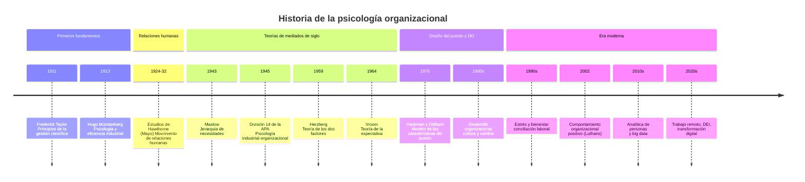

```mermaid
timeline
    title Historia de la psicología organizacional
    section Primeros fundamentos
      1911 : Frederick Taylor<br>Principios de la gestión científica
      1913 : Hugo Münsterberg<br>Psicología y eficiencia industrial
    section Relaciones humanas
      1924-32 : Estudios de Hawthorne<br>(Mayo) Movimiento de relaciones humanas
    section Teorías de mediados de siglo
      1943 : Maslow<br>Jerarquía de necesidades
      1945 : División 14 de la APA<br>Psicología industrial-organizacional
      1959 : Herzberg<br>Teoría de los dos factores
      1964 : Vroom<br>Teoría de la expectativa
    section Diseño del puesto y DO
      1976 : Hackman y Oldham<br>Modelo de las características del puesto
      1980s : Desarrollo organizacional<br>cultura y cambio
    section Era moderna
      1990s : Estrés y bienestar<br>conciliación laboral
      2002 : Comportamiento organizacional<br>positivo (Luthans)
      2010s : Analítica de personas<br>y big data
      2020s : Trabajo remoto, DEI,<br>transformación digital
```
