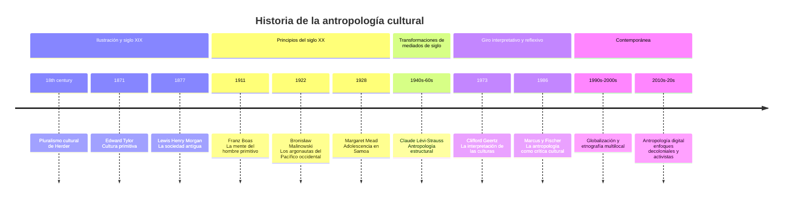

```mermaid
timeline
    title Historia de la antropología cultural
    section Ilustración y siglo XIX
      18th century : Pluralismo cultural de Herder
      1871 : Edward Tylor<br>Cultura primitiva
      1877 : Lewis Henry Morgan<br>La sociedad antigua
    section Principios del siglo XX
      1911 : Franz Boas<br>La mente del hombre primitivo
      1922 : Bronisław Malinowski<br>Los argonautas del Pacífico occidental
      1928 : Margaret Mead<br>Adolescencia en Samoa
    section Transformaciones de mediados de siglo
      1940s‑60s : Claude Lévi‑Strauss<br>Antropología estructural
    section Giro interpretativo y reflexivo
      1973 : Clifford Geertz<br>La interpretación de las culturas
      1986 : Marcus y Fischer<br>La antropología como crítica cultural
    section Contemporánea
      1990s‑2000s : Globalización y<br>etnografía multilocal
      2010s‑20s : Antropología digital<br>enfoques decoloniales y activistas
```
