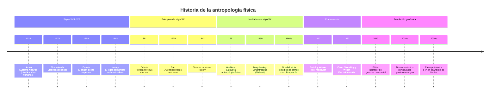

```mermaid
timeline
    title Historia de la antropología física
    section Siglos XVIII-XIX
      1735 : Linneo<br>Systema Naturae (clasifica a los humanos)
      1775 : Blumenbach<br>Clasificación racial
      1859 : Darwin<br>El origen de las especies
      1863 : Huxley<br>El lugar del hombre en la naturaleza
    section Principios del siglo XX
      1891 : Dubois<br>Pithecanthropus erectus
      1925 : Dart<br>Australopithecus africanus
      1942 : Síntesis moderna<br>(Huxley)
    section Mediados del siglo XX
      1951 : Washburn<br>La nueva antropología física
      1959 : Mary Leakey<br>Zinjanthropus (Olduvai)
      1960s : Goodall inicia<br>estudios de campo con chimpancés
    section Era molecular
      1967 : Sarich y Wilson<br>Reloj molecular
      1987 : Cann, Stoneking y Wilson<br>Eva mitocondrial
    section Revolución genómica
      2010 : Pääbo<br>Borrador del genoma neandertal
      2010s : Descubrimientos denisovanos<br>genómica antigua
      2020s : Paleoproteómica<br>e IA en el análisis de fósiles
```
