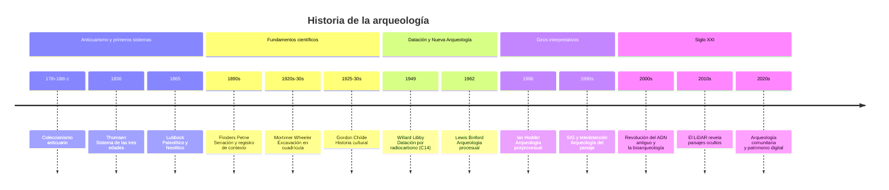

```mermaid
timeline
    title Historia de la arqueología
    section Anticuarismo y primeros sistemas
      17th-18th c : Coleccionismo anticuario
      1836 : Thomsen<br>Sistema de las tres edades
      1865 : Lubbock<br>Paleolítico y Neolítico
    section Fundamentos científicos
      1890s : Flinders Petrie<br>Seriación y registro de contexto
      1920s-30s : Mortimer Wheeler<br>Excavación en cuadrícula
      1925-30s : Gordon Childe<br>Historia cultural
    section Datación y Nueva Arqueología
      1949 : Willard Libby<br>Datación por radiocarbono (C14)
      1962 : Lewis Binford<br>Arqueología procesual
    section Giros interpretativos
      1986 : Ian Hodder<br>Arqueología posprocesual
      1990s : SIG y teledetección<br>Arqueología del paisaje
    section Siglo XXI
      2000s : Revolución del ADN antiguo y<br>la bioarqueología
      2010s : El LiDAR revela<br>paisajes ocultos
      2020s : Arqueología comunitaria<br>y patrimonio digital
```
