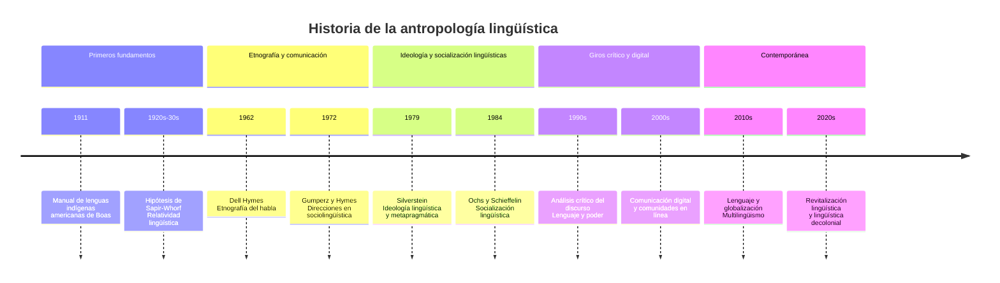

```mermaid
timeline
    title Historia de la antropología lingüística
    section Primeros fundamentos
      1911 : Manual de lenguas indígenas<br>americanas de Boas
      1920s-30s : Hipótesis de Sapir-Whorf<br>Relatividad lingüística
    section Etnografía y comunicación
      1962 : Dell Hymes<br>Etnografía del habla
      1972 : Gumperz y Hymes<br>Direcciones en sociolingüística
    section Ideología y socialización lingüísticas
      1979 : Silverstein<br>Ideología lingüística y metapragmática
      1984 : Ochs y Schieffelin<br>Socialización lingüística
    section Giros crítico y digital
      1990s : Análisis crítico del discurso<br>Lenguaje y poder
      2000s : Comunicación digital<br>y comunidades en línea
    section Contemporánea
      2010s : Lenguaje y globalización<br>Multilingüismo
      2020s : Revitalización lingüística<br>y lingüística decolonial
```
