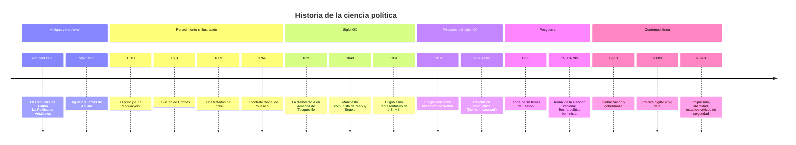

```mermaid
timeline
    title Historia de la ciencia política
    section Antigua y medieval
      4th cent BCE : La República de Platón<br>La Política de Aristóteles
      5th-13th c : Agustín y Tomás de Aquino
    section Renacimiento e Ilustración
      1513 : El príncipe de Maquiavelo
      1651 : Leviatán de Hobbes
      1689 : Dos tratados de Locke
      1762 : El contrato social de Rousseau
    section Siglo XIX
      1835 : La democracia en América de Tocqueville
      1848 : Manifiesto comunista de Marx y Engels
      1861 : El gobierno representativo de J.S. Mill
    section Principios del siglo XX
      1919 : "La política como vocación" de Weber
      1920s‑50s : Revolución conductista<br>(Merriam, Lasswell)
    section Posguerra
      1953 : Teoría de sistemas de Easton
      1960s‑70s : Teoría de la elección racional<br>Teoría política feminista
    section Contemporánea
      1990s : Globalización y gobernanza
      2000s : Política digital y big data
      2020s : Populismo, identidad,<br>estudios críticos de seguridad
```
