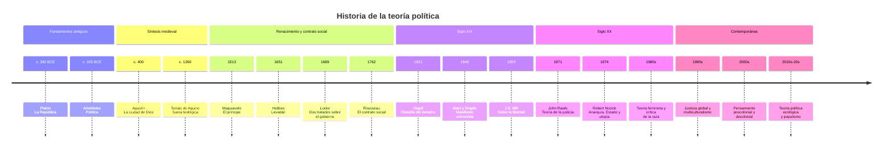

```mermaid
timeline
    title Historia de la teoría política
    section Fundamentos antiguos
      c. 380 BCE : Platón<br>La República
      c. 335 BCE : Aristóteles<br>Política
    section Síntesis medieval
      c. 400 : Agustín<br>La ciudad de Dios
      c. 1260 : Tomás de Aquino<br>Suma teológica
    section Renacimiento y contrato social
      1513 : Maquiavelo<br>El príncipe
      1651 : Hobbes<br>Leviatán
      1689 : Locke<br>Dos tratados sobre el gobierno
      1762 : Rousseau<br>El contrato social
    section Siglo XIX
      1821 : Hegel<br>Filosofía del derecho
      1848 : Marx y Engels<br>Manifiesto comunista
      1859 : J.S. Mill<br>Sobre la libertad
    section Siglo XX
      1971 : John Rawls<br>Teoría de la justicia
      1974 : Robert Nozick<br>Anarquía, Estado y utopía
      1980s : Teoría feminista y crítica<br>de la raza
    section Contemporánea
      1990s : Justicia global y<br>multiculturalismo
      2000s : Pensamiento poscolonial y<br>decolonial
      2010s‑20s : Teoría política ecológica<br>y populismo
```
