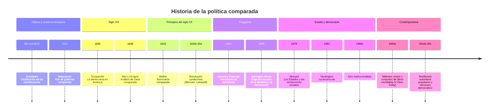

```mermaid
timeline
    title Historia de la política comparada
    section Clásica y moderna temprana
      4th cent BCE : Aristóteles<br>Clasificación de las constituciones
      1513 : Maquiavelo<br>Arte de gobernar comparado
    section Siglo XIX
      1835 : Tocqueville<br>La democracia en América
      1848 : Marx y Engels<br>Análisis de clase comparado
    section Principios del siglo XX
      1919 : Weber<br>Burocracia comparada
      1920s‑50s : Revolución conductista<br>(Merriam, Lasswell)
    section Posguerra
      1960 : Almond y Coleman<br>Funcionalismo estructural
      1966 : Barrington Moore<br>Orígenes sociales de la dictadura y la democracia
    section Estado y democracia
      1979 : Skocpol<br>Los Estados y las revoluciones sociales
      1991 : Huntington<br>La tercera ola
      1990s : Giro institucionalista
    section Contemporánea
      2000s : Métodos mixtos y<br>conjuntos de datos mundiales (V‑Dem, Polity)
      2010s‑20s : Resiliencia autoritaria<br>populismo y retroceso democrático
```
