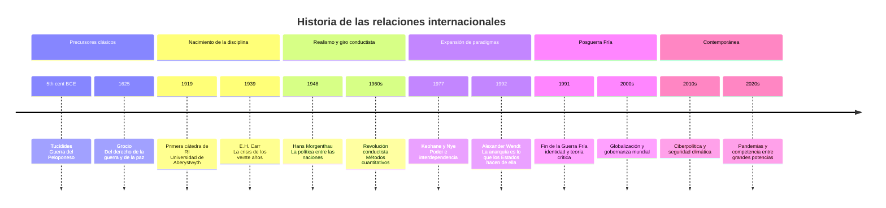

```mermaid
timeline
    title Historia de las relaciones internacionales
    section Precursores clásicos
      5th cent BCE : Tucídides<br>Guerra del Peloponeso
      1625 : Grocio<br>Del derecho de la guerra y de la paz
    section Nacimiento de la disciplina
      1919 : Primera cátedra de RI<br>Universidad de Aberystwyth
      1939 : E.H. Carr<br>La crisis de los veinte años
    section Realismo y giro conductista
      1948 : Hans Morgenthau<br>La política entre las naciones
      1960s : Revolución conductista<br>Métodos cuantitativos
    section Expansión de paradigmas
      1977 : Keohane y Nye<br>Poder e interdependencia
      1992 : Alexander Wendt<br>La anarquía es lo que los Estados hacen de ella
    section Posguerra Fría
      1991 : Fin de la Guerra Fría<br>identidad y teoría crítica
      2000s : Globalización y<br>gobernanza mundial
    section Contemporánea
      2010s : Ciberpolítica y<br>seguridad climática
      2020s : Pandemias y<br>competencia entre grandes potencias
```
