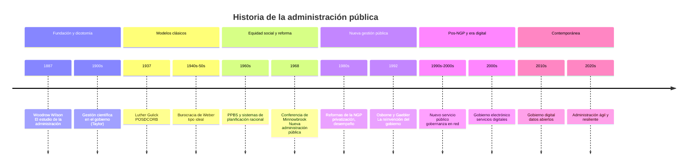

```mermaid
timeline
    title Historia de la administración pública
    section Fundación y dicotomía
      1887 : Woodrow Wilson<br>El estudio de la administración
      1900s : Gestión científica<br>en el gobierno (Taylor)
    section Modelos clásicos
      1937 : Luther Gulick<br>POSDCORB
      1940s‑50s : Burocracia de Weber<br>tipo ideal
    section Equidad social y reforma
      1960s : PPBS y sistemas de<br>planificación racional
      1968 : Conferencia de Minnowbrook<br>Nueva administración pública
    section Nueva gestión pública
      1980s : Reformas de la NGP<br>privatización, desempeño
      1992 : Osborne y Gaebler<br>La reinvención del gobierno
    section Pos-NGP y era digital
      1990s‑2000s : Nuevo servicio público<br>gobernanza en red
      2000s : Gobierno electrónico<br>servicios digitales
    section Contemporánea
      2010s : Gobierno digital<br>datos abiertos
      2020s : Administración ágil y<br>resiliente
```
