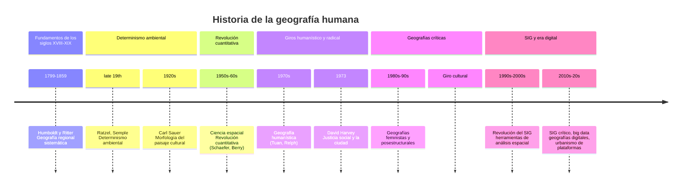

```mermaid
timeline
    title Historia de la geografía humana
    section Fundamentos de los siglos XVIII-XIX
      1799‑1859 : Humboldt y Ritter<br>Geografía regional sistemática
    section Determinismo ambiental
      late 19th : Ratzel, Semple<br>Determinismo ambiental
      1920s : Carl Sauer<br>Morfología del paisaje cultural
    section Revolución cuantitativa
      1950s‑60s : Ciencia espacial<br>Revolución cuantitativa (Schaefer, Berry)
    section Giros humanístico y radical
      1970s : Geografía humanística<br>(Tuan, Relph)
      1973 : David Harvey<br>Justicia social y la ciudad
    section Geografías críticas
      1980s‑90s : Geografías feministas y<br>posestructurales
      Giro cultural
    section SIG y era digital
      1990s‑2000s : Revolución del SIG<br>herramientas de análisis espacial
      2010s‑20s : SIG crítico, big data<br>geografías digitales, urbanismo de plataformas
```
