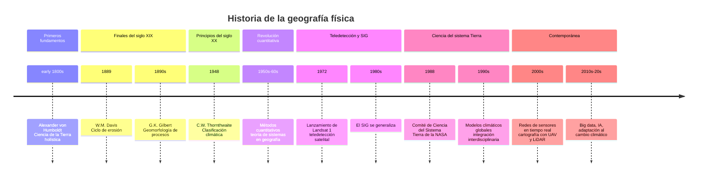

```mermaid
timeline
    title Historia de la geografía física
    section Primeros fundamentos
      early 1800s : Alexander von Humboldt<br>Ciencia de la Tierra holística
    section Finales del siglo XIX
      1889 : W.M. Davis<br>Ciclo de erosión
      1890s : G.K. Gilbert<br>Geomorfología de procesos
    section Principios del siglo XX
      1948 : C.W. Thornthwaite<br>Clasificación climática
    section Revolución cuantitativa
      1950s‑60s : Métodos cuantitativos<br>teoría de sistemas en geografía
    section Teledetección y SIG
      1972 : Lanzamiento de Landsat 1<br>teledetección satelital
      1980s : El SIG se generaliza
    section Ciencia del sistema Tierra
      1988 : Comité de Ciencia del Sistema<br>Tierra de la NASA
      1990s : Modelos climáticos globales<br>integración interdisciplinaria
    section Contemporánea
      2000s : Redes de sensores en tiempo real<br>cartografía con UAV y LiDAR
      2010s‑20s : Big data, IA,<br>adaptación al cambio climático
```
