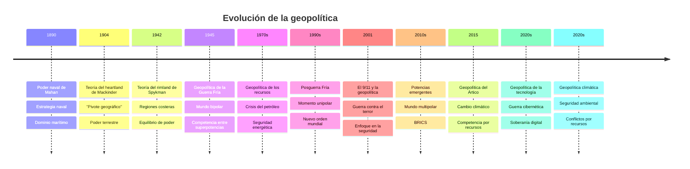

```mermaid
timeline
    title Evolución de la geopolítica
    1890 : Poder naval de Mahan
          : Estrategia naval
          : Dominio marítimo
    1904 : Teoría del heartland de Mackinder
          : "Pivote geográfico"
          : Poder terrestre
    1942 : Teoría del rimland de Spykman
          : Regiones costeras
          : Equilibrio de poder
    1945 : Geopolítica de la Guerra Fría
          : Mundo bipolar
          : Competencia entre superpotencias
    1970s : Geopolítica de los recursos
          : Crisis del petróleo
          : Seguridad energética
    1990s : Posguerra Fría
          : Momento unipolar
          : Nuevo orden mundial
    2001 : El 9/11 y la geopolítica
          : Guerra contra el terror
          : Enfoque en la seguridad
    2010s : Potencias emergentes
          : Mundo multipolar
          : BRICS
    2015 : Geopolítica del Ártico
          : Cambio climático
          : Competencia por recursos
    2020s : Geopolítica de la tecnología
          : Guerra cibernética
          : Soberanía digital
    2020s : Geopolítica climática
          : Seguridad ambiental
          : Conflictos por recursos
```
