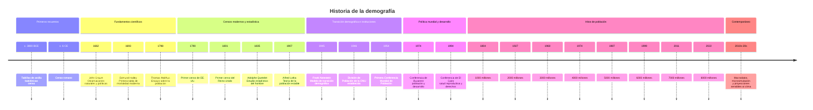

```mermaid
timeline
    title Historia de la demografía
    section Primeros recuentos
      c. 3800 BCE : Tablillas de arcilla babilónicas<br>censo
      c. 6 CE : Censo romano
    section Fundamentos científicos
      1662 : John Graunt<br>Observaciones naturales y políticas
      1693 : Edmund Halley<br>Primera tabla de mortalidad moderna
      1798 : Thomas Malthus<br>Ensayo sobre la población
    section Censos modernos y estadística
      1790 : Primer censo de EE. UU.
      1801 : Primer censo del Reino Unido
      1835 : Adolphe Quetelet<br>Estudio estadístico del hombre
      1907 : Alfred Lotka<br>Teoría de la población estable
    section Transición demográfica e instituciones
      1945 : Frank Notestein<br>Modelo de transición demográfica
      1946 : División de Población de la ONU<br>establecida
      1954 : Primera Conferencia Mundial de Población
    section Política mundial y desarrollo
      1974 : Conferencia de Bucarest<br>población y desarrollo
      1994 : Conferencia de El Cairo<br>salud reproductiva y derechos
    section Hitos de población
      1804 : 1000 millones
      1927 : 2000 millones
      1960 : 3000 millones
      1974 : 4000 millones
      1987 : 5000 millones
      1999 : 6000 millones
      2011 : 7000 millones
      2022 : 8000 millones
    section Contemporáneo
      2010s-20s : Macrodatos, microsimulación<br>y proyecciones sensibles al clima
```
