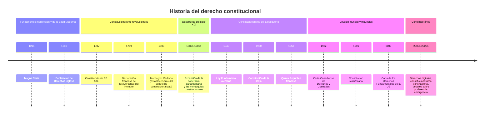

```mermaid
timeline
    title Historia del derecho constitucional
    section Fundamentos medievales y de la Edad Moderna
      1215 : Magna Carta
      1689 : Declaración de Derechos inglesa
    section Constitucionalismo revolucionario
      1787 : Constitución de EE. UU.
      1789 : Declaración francesa de<br>los Derechos del Hombre
      1803 : Marbury v. Madison<br>(establecimiento del control de constitucionalidad)
    section Desarrollos del siglo XIX
      1830s-1900s : Expansión de la<br>soberanía parlamentaria<br>y las monarquías constitucionales
    section Constitucionalismo de la posguerra
      1949 : Ley Fundamental alemana
      1950 : Constitución de la India
      1958 : Quinta República francesa
    section Difusión mundial y tribunales
      1982 : Carta Canadiense de<br>Derechos y Libertades
      1996 : Constitución sudafricana
      2000 : Carta de los Derechos<br>Fundamentales de la UE
    section Contemporáneo
      2000s‑2020s : Derechos digitales,<br>constitucionalismo transnacional,<br>debates sobre poderes de emergencia
```
