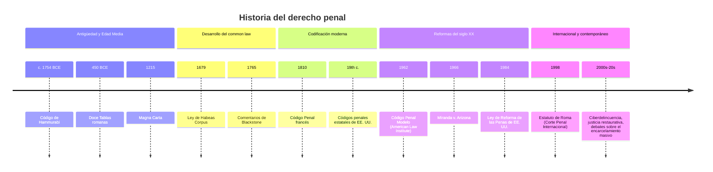

```mermaid
timeline
    title Historia del derecho penal
    section Antigüedad y Edad Media
      c. 1754 BCE : Código de Hammurabi
      450 BCE : Doce Tablas romanas
      1215 : Magna Carta
    section Desarrollo del common law
      1679 : Ley de Habeas Corpus
      1765 : Comentarios de Blackstone
    section Codificación moderna
      1810 : Código Penal francés
      19th c. : Códigos penales estatales de EE. UU.
    section Reformas del siglo XX
      1962 : Código Penal Modelo<br>(American Law Institute)
      1966 : Miranda v. Arizona
      1984 : Ley de Reforma de las Penas de EE. UU.
    section Internacional y contemporáneo
      1998 : Estatuto de Roma<br>(Corte Penal Internacional)
      2000s‑20s : Ciberdelincuencia,<br>justicia restaurativa,<br>debates sobre el encarcelamiento masivo
```
