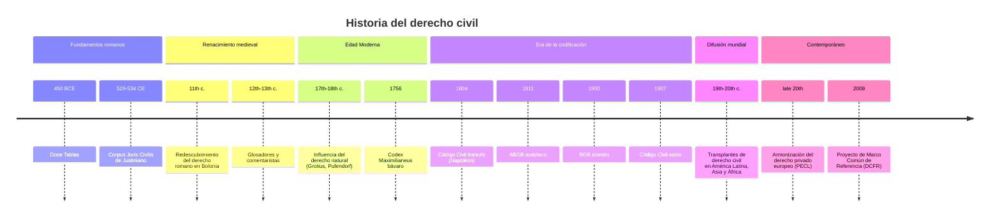

```mermaid
timeline
    title Historia del derecho civil
    section Fundamentos romanos
      450 BCE : Doce Tablas
      529‑534 CE : Corpus Juris Civilis<br>de Justiniano
    section Renacimiento medieval
      11th c. : Redescubrimiento del derecho<br>romano en Bolonia
      12th‑13th c. : Glosadores y<br>comentaristas
    section Edad Moderna
      17th‑18th c. : Influencia del derecho natural<br>(Grotius, Pufendorf)
      1756 : Codex Maximilianeus bávaro
    section Era de la codificación
      1804 : Código Civil francés<br>(Napoléon)
      1811 : ABGB austriaco
      1900 : BGB alemán
      1907 : Código Civil suizo
    section Difusión mundial
      19th‑20th c. : Transplantes de derecho civil<br>en América Latina, Asia y África
    section Contemporáneo
      late 20th : Armonización del derecho privado<br>europeo (PECL)
      2009 : Proyecto de Marco Común de<br>Referencia (DCFR)
```
