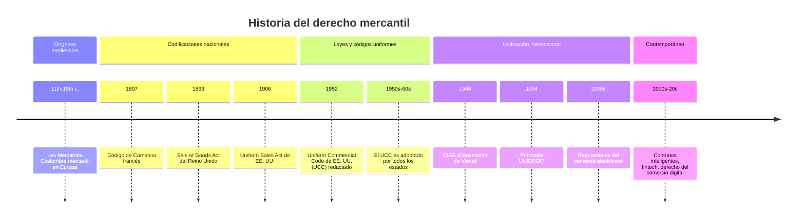

```mermaid
timeline
    title Historia del derecho mercantil
    section Orígenes medievales
      11th‑15th c. : Lex Mercatoria<br>Costumbre mercantil en Europa
    section Codificaciones nacionales
      1807 : Código de Comercio francés
      1893 : Sale of Goods Act del Reino Unido
      1906 : Uniform Sales Act de EE. UU.
    section Leyes y códigos uniformes
      1952 : Uniform Commercial Code de EE. UU.<br>(UCC) redactado
      1950s‑60s : El UCC es adoptado por todos los estados
    section Unificación internacional
      1980 : CISG (Convención de Viena)
      1994 : Principios UNIDROIT
      2000s : Regulaciones del<br>comercio electrónico
    section Contemporáneo
      2010s‑20s : Contratos inteligentes,<br>fintech, derecho del comercio digital
```
