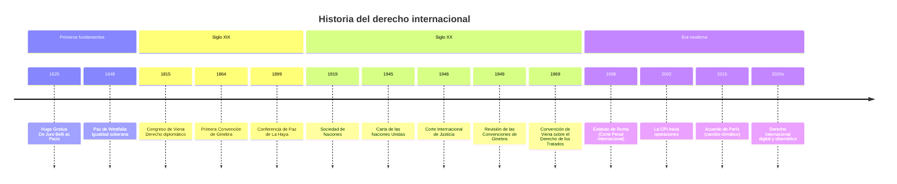

```mermaid
timeline
    title Historia del derecho internacional
    section Primeros fundamentos
      1625 : Hugo Grotius<br>De Jure Belli ac Pacis
      1648 : Paz de Westfalia<br>Igualdad soberana
    section Siglo XIX
      1815 : Congreso de Viena<br>Derecho diplomático
      1864 : Primera Convención de Ginebra
      1899 : Conferencia de Paz de La Haya
    section Siglo XX
      1919 : Sociedad de Naciones
      1945 : Carta de las Naciones Unidas
      1946 : Corte Internacional de Justicia
      1949 : Revisión de las Convenciones de Ginebra
      1969 : Convención de Viena sobre el Derecho de los Tratados
    section Era moderna
      1998 : Estatuto de Roma<br>(Corte Penal Internacional)
      2002 : La CPI inicia operaciones
      2015 : Acuerdo de París<br>(cambio climático)
      2020s : Derecho internacional<br>digital y cibernético
```
