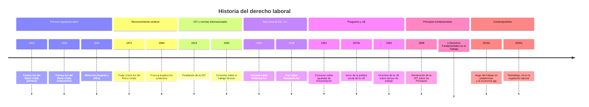

```mermaid
timeline
    title Historia del derecho laboral
    section Primera regulación fabril
      1802 : Factory Act del Reino Unido (primera)
      1833 : Factory Act del Reino Unido (inspectores)
      1842 : Mines Act (mujeres y niños)
    section Reconocimiento sindical
      1871 : Trade Union Act del Reino Unido
      1884 : Francia legaliza los sindicatos
    section OIT y normas internacionales
      1919 : Fundación de la OIT
      1930 : Convenio sobre el trabajo forzoso
    section New Deal de EE. UU.
      1935 : National Labor Relations Act
      1938 : Fair Labor Standards Act
    section Posguerra y UE
      1951 : Convenio sobre igualdad de remuneración
      1970s : Inicio de la política social de la UE
      1993 : Directiva de la UE sobre tiempo de trabajo
    section Principios fundamentales
      1998 : Declaración de la OIT sobre los Principios
      y Derechos Fundamentales en el Trabajo
    section Contemporáneo
      2010s : Auge del trabajo en plataformas<br>y la economía gig
      2020s : Teletrabajo, IA en la<br>regulación laboral
```
