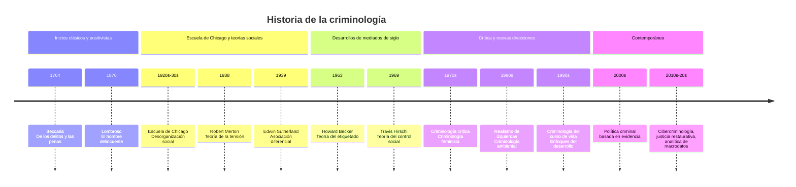

```mermaid
timeline
    title Historia de la criminología
    section Inicios clásicos y positivistas
      1764 : Beccaria<br>De los delitos y las penas
      1876 : Lombroso<br>El hombre delincuente
    section Escuela de Chicago y teorías sociales
      1920s‑30s : Escuela de Chicago<br>Desorganización social
      1938 : Robert Merton<br>Teoría de la tensión
      1939 : Edwin Sutherland<br>Asociación diferencial
    section Desarrollos de mediados de siglo
      1963 : Howard Becker<br>Teoría del etiquetado
      1969 : Travis Hirschi<br>Teoría del control social
    section Crítica y nuevas direcciones
      1970s : Criminología crítica<br>Criminología feminista
      1980s : Realismo de izquierdas<br>Criminología ambiental
      1990s : Criminología del curso de vida<br>Enfoques del desarrollo
    section Contemporáneo
      2000s : Política criminal<br>basada en evidencia
      2010s‑20s : Cibercriminología,<br>justicia restaurativa,<br>analítica de macrodatos
```
