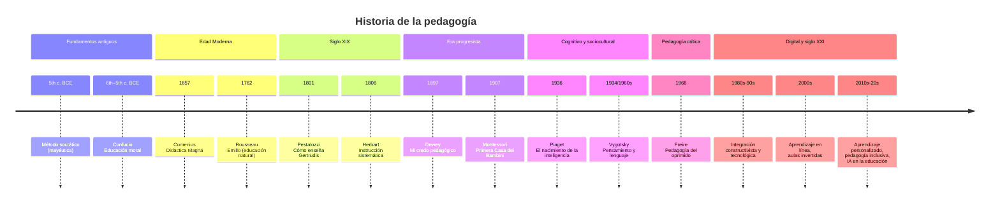

```mermaid
timeline
    title Historia de la pedagogía
    section Fundamentos antiguos
      5th c. BCE : Método socrático<br>(mayéutica)
      6th–5th c. BCE : Confucio<br>Educación moral
    section Edad Moderna
      1657 : Comenius<br>Didactica Magna
      1762 : Rousseau<br>Emilio (educación natural)
    section Siglo XIX
      1801 : Pestalozzi<br>Cómo enseña Gertrudis
      1806 : Herbart<br>Instrucción sistemática
    section Era progresista
      1897 : Dewey<br>Mi credo pedagógico
      1907 : Montessori<br>Primera Casa dei Bambini
    section Cognitivo y sociocultural
      1936 : Piaget<br>El nacimiento de la inteligencia
      1934/1960s : Vygotsky<br>Pensamiento y lenguaje
    section Pedagogía crítica
      1968 : Freire<br>Pedagogía del oprimido
    section Digital y siglo XXI
      1980s‑90s : Integración constructivista y<br>tecnológica
      2000s : Aprendizaje en línea,<br>aulas invertidas
      2010s‑20s : Aprendizaje personalizado,<br>pedagogía inclusiva, IA en la educación
```
