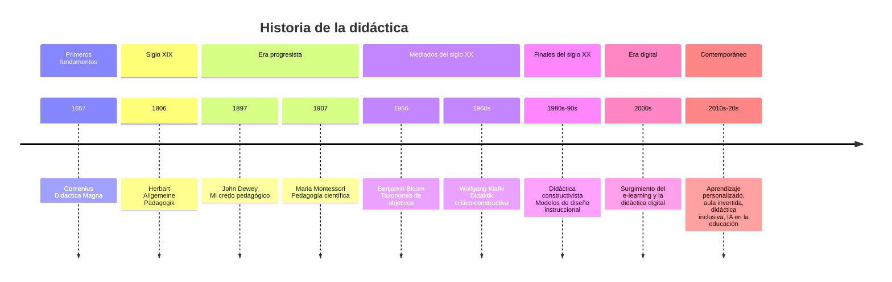

```mermaid
timeline
    title Historia de la didáctica
    section Primeros fundamentos
      1657 : Comenius<br>Didactica Magna
    section Siglo XIX
      1806 : Herbart<br>Allgemeine Pädagogik
    section Era progresista
      1897 : John Dewey<br>Mi credo pedagógico
      1907 : Maria Montessori<br>Pedagogía científica
    section Mediados del siglo XX
      1956 : Benjamin Bloom<br>Taxonomía de objetivos
      1960s : Wolfgang Klafki<br>Didaktik crítico‑constructiva
    section Finales del siglo XX
      1980s‑90s : Didáctica constructivista<br>Modelos de diseño instruccional
    section Era digital
      2000s : Surgimiento del e‑learning y la<br>didáctica digital
    section Contemporáneo
      2010s‑20s : Aprendizaje personalizado,<br>aula invertida, didáctica<br>inclusiva, IA en la educación
```
