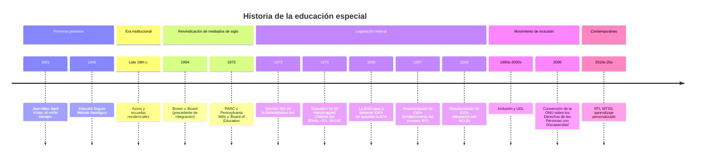

```mermaid
timeline
    title Historia de la educación especial
    section Primeros pioneros
      1801 : Jean‑Marc Itard<br>Víctor, el «niño salvaje»
      1846 : Edouard Seguin<br>Método fisiológico
    section Era institucional
      Late 19th c. : Asilos y<br>escuelas residenciales
    section Reivindicación de mediados de siglo
      1954 : Brown v. Board<br>(precedente de integración)
      1972 : PARC v. Pennsylvania<br>Mills v. Board of Education
    section Legislación federal
      1973 : Sección 504 de<br>la Rehabilitation Act
      1975 : Education for All<br>Handicapped Children Act<br>(EHA) – P.L. 94‑142
      1990 : La EHA pasa a llamarse IDEA<br>Se aprueba la ADA
      1997 : Reautorización de IDEA<br>(fortalecimiento del proceso IEP)
      2004 : Reautorización de IDEA<br>(alineación con NCLB)
    section Movimiento de inclusión
      1990s‑2000s : Inclusión y UDL
      2006 : Convención de la ONU sobre los<br>Derechos de las Personas con Discapacidad
    section Contemporáneo
      2010s‑20s : RTI, MTSS,<br>aprendizaje personalizado
```
