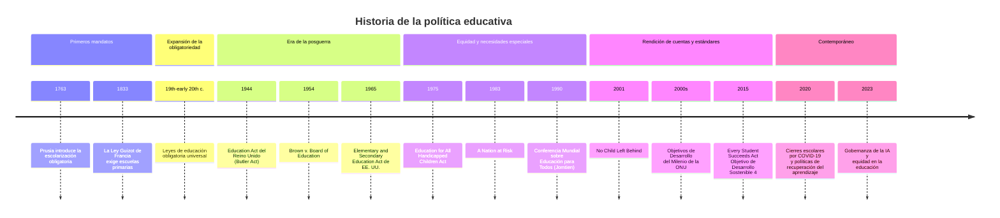

```mermaid
timeline
    title Historia de la política educativa
    section Primeros mandatos
      1763 : Prusia introduce la<br>escolarización obligatoria
      1833 : La Ley Guizot de Francia<br>exige escuelas primarias
    section Expansión de la obligatoriedad
      19th‑early 20th c. : Leyes de educación<br>obligatoria universal
    section Era de la posguerra
      1944 : Education Act del Reino Unido<br>(Butler Act)
      1954 : Brown v. Board of Education
      1965 : Elementary and<br>Secondary Education Act de EE. UU.
    section Equidad y necesidades especiales
      1975 : Education for All<br>Handicapped Children Act
      1983 : A Nation at Risk
      1990 : Conferencia Mundial sobre<br>Educación para Todos (Jomtien)
    section Rendición de cuentas y estándares
      2001 : No Child Left Behind
      2000s : Objetivos de Desarrollo<br>del Milenio de la ONU
      2015 : Every Student Succeeds Act<br>Objetivo de Desarrollo Sostenible 4
    section Contemporáneo
      2020 : Cierres escolares por COVID‑19<br>y políticas de recuperación del aprendizaje
      2023 : Gobernanza de la IA y<br>equidad en la educación
```
