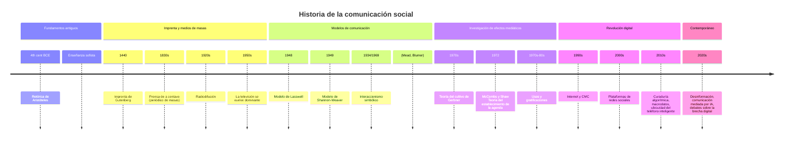

```mermaid
timeline
    title Historia de la comunicación social
    section Fundamentos antiguos
      4th cent BCE : Retórica de Aristóteles
      Enseñanza sofista
    section Imprenta y medios de masas
      1440 : Imprenta de Gutenberg
      1830s : Prensa de a centavo (periódico de masas)
      1920s : Radiodifusión
      1950s : La televisión se vuelve dominante
    section Modelos de comunicación
      1948 : Modelo de Lasswell
      1949 : Modelo de Shannon‑Weaver
      1934/1969 : Interaccionismo simbólico
      (Mead, Blumer)
    section Investigación de efectos mediáticos
      1970s : Teoría del cultivo de Gerbner
      1972 : McCombs y Shaw<br>Teoría del establecimiento de la agenda
      1970s‑80s : Usos y gratificaciones
    section Revolución digital
      1990s : Internet y CMC
      2000s : Plataformas de redes sociales
      2010s : Curaduría algorítmica,<br>macrodatos, ubicuidad del teléfono inteligente
    section Contemporáneo
      2020s : Desinformación,<br>comunicación mediada por IA,<br>debates sobre la brecha digital
```
