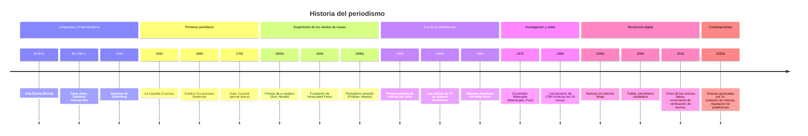

```mermaid
timeline
    title Historia del periodismo
    section Antigüedad y Edad Moderna
      59 BCE : Acta Diurna (Roma)
      8th‑15th c. : Tipao chino,<br>boletines manuscritos
      1440 : Imprenta de Gutenberg
    section Primeros periódicos
      1631 : La Gazette (Francia)
      1690 : Publick Occurrences (América)
      1702 : Daily Courant (primer diario)
    section Surgimiento de los medios de masas
      1830s : Prensa de a centavo (Sun, Herald)
      1846 : Fundación de Associated Press
      1890s : Periodismo amarillo<br>(Pulitzer, Hearst)
    section Era de la radiodifusión
      1920 : Primera emisión de noticias por radio
      1950s : Las noticias de TV se vuelven dominantes
      1960 : Debates televisivos Kennedy‑Nixon
    section Investigación y cable
      1972 : Escándalo Watergate<br>(Washington Post)
      1980 : Lanzamiento de CNN (noticias las 24 horas)
    section Revolución digital
      1990s : Noticias en internet, blogs
      2006 : Twitter, periodismo ciudadano
      2016 : Crisis de las noticias falsas,<br>movimiento de verificación de hechos
    section Contemporáneo
      2020s : Noticias generadas por IA,<br>evitación de noticias, regulación de plataformas
```
