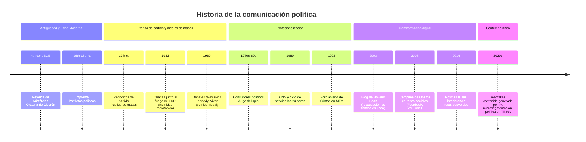

```mermaid
timeline
    title Historia de la comunicación política
    section Antigüedad y Edad Moderna
      4th cent BCE : Retórica de Aristóteles<br>Oratoria de Cicerón
      16th‑18th c. : Imprenta<br>Panfletos políticos
    section Prensa de partido y medios de masas
      19th c. : Periódicos de partido<br>Público de masas
      1933 : Charlas junto al fuego de FDR<br>(intimidad radiofónica)
      1960 : Debates televisivos Kennedy‑Nixon<br>(política visual)
    section Profesionalización
      1970s‑80s : Consultores políticos<br>Auge del spin
      1980 : CNN y ciclo de noticias las 24 horas
      1992 : Foro abierto de Clinton en MTV
    section Transformación digital
      2003 : Blog de Howard Dean<br>(recaudación de fondos en línea)
      2008 : Campaña de Obama en redes sociales<br>(Facebook, YouTube)
      2016 : Noticias falsas, interferencia<br>rusa, posverdad
    section Contemporáneo
      2020s : Deepfakes, contenido generado<br>por IA, microsegmentación,<br>política en TikTok
```
