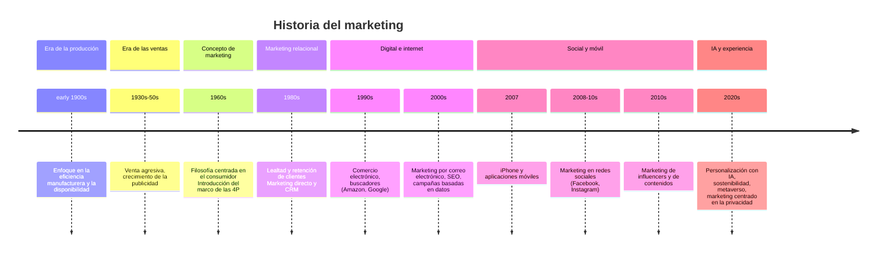

```mermaid
timeline
    title Historia del marketing
    section Era de la producción
      early 1900s : Enfoque en la eficiencia<br>manufacturera y la disponibilidad
    section Era de las ventas
      1930s‑50s : Venta agresiva,<br>crecimiento de la publicidad
    section Concepto de marketing
      1960s : Filosofía centrada en el consumidor<br>Introducción del marco de las 4P
    section Marketing relacional
      1980s : Lealtad y retención de clientes<br>Marketing directo y CRM
    section Digital e internet
      1990s : Comercio electrónico, buscadores<br>(Amazon, Google)
      2000s : Marketing por correo electrónico, SEO,<br>campañas basadas en datos
    section Social y móvil
      2007 : iPhone y aplicaciones móviles
      2008‑10s : Marketing en redes sociales<br>(Facebook, Instagram)
      2010s : Marketing de influencers y de contenidos
    section IA y experiencia
      2020s : Personalización con IA,<br>sostenibilidad, metaverso,<br>marketing centrado en la privacidad
```
