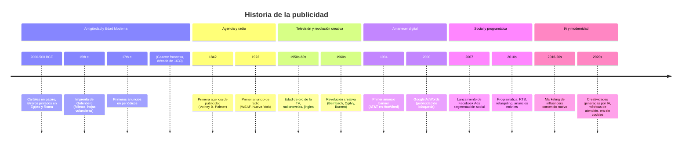

```mermaid
timeline
    title Historia de la publicidad
    section Antigüedad y Edad Moderna
      2000‑500 BCE : Carteles en papiro,<br>letreros pintados en Egipto y Roma
      15th c. : Imprenta de Gutenberg<br>(folletos, hojas volanderas)
      17th c. : Primeros anuncios en periódicos
      (Gazette francesa, década de 1630)
    section Agencia y radio
      1842 : Primera agencia de publicidad<br>(Volney B. Palmer)
      1922 : Primer anuncio de radio<br>(WEAF, Nueva York)
    section Televisión y revolución creativa
      1950s‑60s : Edad de oro de la TV,<br>radionovelas, jingles
      1960s : Revolución creativa<br>(Bernbach, Ogilvy, Burnett)
    section Amanecer digital
      1994 : Primer anuncio banner<br>(AT&T en HotWired)
      2000 : Google AdWords<br>(publicidad de búsqueda)
    section Social y programática
      2007 : Lanzamiento de Facebook Ads<br>segmentación social
      2010s : Programática, RTB,<br>retargeting, anuncios móviles
    section IA y modernidad
      2016‑20s : Marketing de influencers<br>contenido nativo
      2020s : Creatividades generadas por IA,<br>métricas de atención, era sin cookies
```
