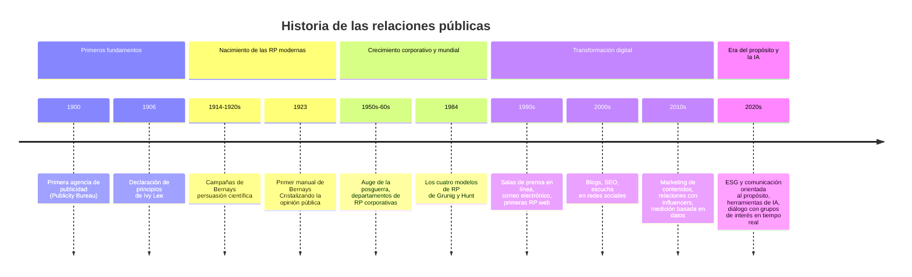

```mermaid
timeline
    title Historia de las relaciones públicas
    section Primeros fundamentos
      1900 : Primera agencia de publicidad<br>(Publicity Bureau)
      1906 : Declaración de principios<br>de Ivy Lee
    section Nacimiento de las RP modernas
      1914‑1920s : Campañas de Bernays<br>persuasión científica
      1923 : Primer manual de Bernays<br>Cristalizando la opinión pública
    section Crecimiento corporativo y mundial
      1950s‑60s : Auge de la posguerra,<br>departamentos de RP corporativas
      1984 : Los cuatro modelos de RP<br>de Grunig y Hunt
    section Transformación digital
      1990s : Salas de prensa en línea,<br>correo electrónico, primeras RP web
      2000s : Blogs, SEO, escucha<br>en redes sociales
      2010s : Marketing de contenidos,<br>relaciones con influencers,<br>medición basada en datos
    section Era del propósito y la IA
      2020s : ESG y comunicación orientada<br>al propósito, herramientas de IA,<br>diálogo con grupos de interés en tiempo real
```
