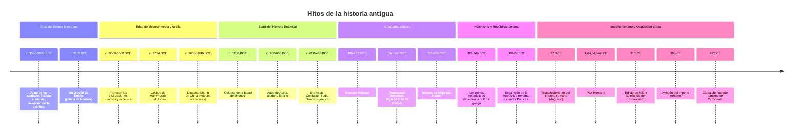

```mermaid
timeline
    title Hitos de la historia antigua
    section Edad del Bronce temprana
      c. 3500‑3000 BCE : Auge de las ciudades‑Estado sumerias,<br>invención de la escritura
      c. 3100 BCE : Unificación de Egipto<br>(paleta de Narmer)
    section Edad del Bronce media y tardía
      c. 2000‑1600 BCE : Florecen las civilizaciones<br>minoica y micénica
      c. 1754 BCE : Código de Hammurabi<br>(Babilonia)
      c. 1600‑1046 BCE : Dinastía Shang<br>en China (huesos oraculares)
    section Edad del Hierro y Era Axial
      c. 1200 BCE : Colapso de la Edad del Bronce
      c. 900‑600 BCE : Auge de Asiria,<br>alfabeto fenicio
      c. 600‑400 BCE : Era Axial -<br>Confucio, Buda, filósofos griegos
    section Antigüedad clásica
      490‑479 BCE : Guerras Médicas
      5th cent BCE : Democracia ateniense,<br>Siglo de Oro de Grecia
      336‑323 BCE : Imperio de Alejandro Magno
    section Helenismo y República romana
      323‑146 BCE : Los reinos helenísticos<br>difunden la cultura griega
      509‑27 BCE : Expansión de la República romana,<br>Guerras Púnicas
    section Imperio romano y Antigüedad tardía
      27 BCE : Establecimiento del Imperio romano<br>(Augusto)
      1st‑2nd cent CE : Pax Romana
      313 CE : Edicto de Milán<br>(tolerancia del cristianismo)
      395 CE : División del Imperio romano
      476 CE : Caída del Imperio romano de Occidente
```
