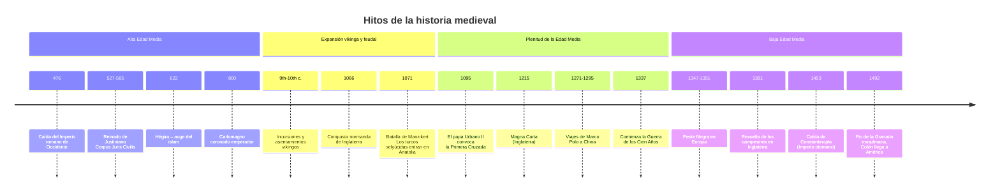

```mermaid
timeline
    title Hitos de la historia medieval
    section Alta Edad Media
      476 : Caída del Imperio romano de Occidente
      527‑565 : Reinado de Justiniano<br>Corpus Juris Civilis
      622 : Hégira – auge del islam
      800 : Carlomagno coronado emperador
    section Expansión vikinga y feudal
      9th‑10th c. : Incursiones y asentamientos vikingos
      1066 : Conquista normanda de Inglaterra
      1071 : Batalla de Manzikert<br>Los turcos selyúcidas entran en Anatolia
    section Plenitud de la Edad Media
      1095 : El papa Urbano II convoca<br>la Primera Cruzada
      1215 : Magna Carta (Inglaterra)
      1271‑1295 : Viajes de Marco Polo a China
      1337 : Comienza la Guerra de los Cien Años
    section Baja Edad Media
      1347‑1351 : Peste Negra en Europa
      1381 : Revuelta de los campesinos en Inglaterra
      1453 : Caída de Constantinopla<br>(Imperio otomano)
      1492 : Fin de la Granada musulmana,<br>Colón llega a América
```
