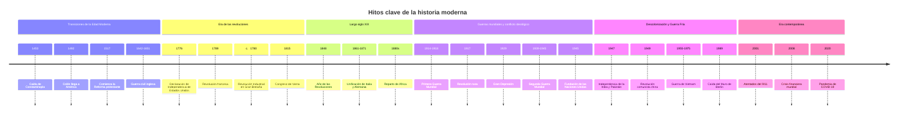

```mermaid
timeline
    title Hitos clave de la historia moderna
    section Transiciones de la Edad Moderna
      1453 : Caída de Constantinopla
      1492 : Colón llega a América
      1517 : Comienza la Reforma protestante
      1642‑1651 : Guerra civil inglesa
    section Era de las revoluciones
      1776 : Declaración de Independencia de Estados Unidos
      1789 : Revolución francesa
      c. 1780 : Revolución Industrial en Gran Bretaña
      1815 : Congreso de Viena
    section Largo siglo XIX
      1848 : Año de las Revoluciones
      1861‑1871 : Unificación de Italia y Alemania
      1880s : Reparto de África
    section Guerras mundiales y conflicto ideológico
      1914‑1918 : Primera Guerra Mundial
      1917 : Revolución rusa
      1929 : Gran Depresión
      1939‑1945 : Segunda Guerra Mundial
      1945 : Fundación de las Naciones Unidas
    section Descolonización y Guerra Fría
      1947 : Independencia de la India y Pakistán
      1949 : Revolución comunista china
      1955‑1975 : Guerra de Vietnam
      1989 : Caída del Muro de Berlín
    section Era contemporánea
      2001 : Atentados del 9/11
      2008 : Crisis financiera mundial
      2020 : Pandemia de COVID‑19
```
