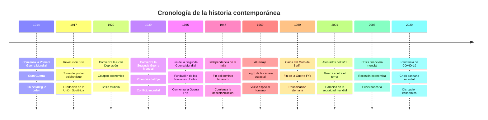

```mermaid
timeline
    title Cronología de la historia contemporánea
    1914 : Comienza la Primera Guerra Mundial
          : Gran Guerra
          : Fin del antiguo orden
    1917 : Revolución rusa
          : Toma del poder bolchevique
          : Fundación de la Unión Soviética
    1929 : Comienza la Gran Depresión
          : Colapso económico
          : Crisis mundial
    1939 : Comienza la Segunda Guerra Mundial
          : Potencias del Eje
          : Conflicto mundial
    1945 : Fin de la Segunda Guerra Mundial
          : Fundación de las Naciones Unidas
          : Comienza la Guerra Fría
    1947 : Independencia de la India
          : Fin del dominio británico
          : Comienza la descolonización
    1969 : Alunizaje
          : Logro de la carrera espacial
          : Vuelo espacial humano
    1989 : Caída del Muro de Berlín
          : Fin de la Guerra Fría
          : Reunificación alemana
    2001 : Atentados del 9/11
          : Guerra contra el terror
          : Cambios en la seguridad mundial
    2008 : Crisis financiera mundial
          : Recesión económica
          : Crisis bancaria
    2020 : Pandemia de COVID-19
          : Crisis sanitaria mundial
          : Disrupción económica
```
