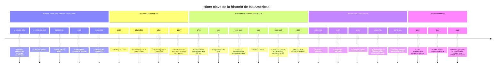

```mermaid
timeline
    title Hitos clave de la historia de las Américas
    section Primeras migraciones y período precolombino
      c. 20,000 BCE : Primeras migraciones humanas<br>vía Beringia
      c. 1500‑300 BCE : Civilización olmeca
      250‑900 CE : Período clásico maya
      1325 : Fundación de Tenochtitlan (azteca)
      1438‑1533 : Expansión del Imperio inca
    section Conquista y colonización
      1492 : Colón llega al Caribe
      1519‑1521 : Cortés conquista el Imperio azteca
      1532 : Pizarro conquista el Imperio inca
      1607 : Jamestown (primer asentamiento inglés permanente)
    section Independencia y construcción nacional
      1776 : Declaración de Independencia de EE. UU.
      1804 : Independencia de Haití
      1810‑1825 : Guerras de independencia hispanoamericanas
      1823 : Doctrina Monroe
      1861‑1865 : Guerra de Secesión, abolición de la esclavitud en EE. UU.
      1888 : Abolición de la esclavitud en Brasil
    section Revoluciones y cambio social
      1910‑1920 : Revolución mexicana
      1917 : Constitución mexicana
      1959 : Revolución cubana
      1960s‑70s : Movimientos por los derechos civiles, activismo indígena
      1970s‑80s : Dictaduras militares en América del Sur
    section Era contemporánea
      1994 : TLCAN, levantamiento zapatista (México)
      2006 : Evo Morales es elegido en Bolivia
      2020 : Pandemia, protestas renovadas por la equidad racial<br>en todo el hemisferio
```
