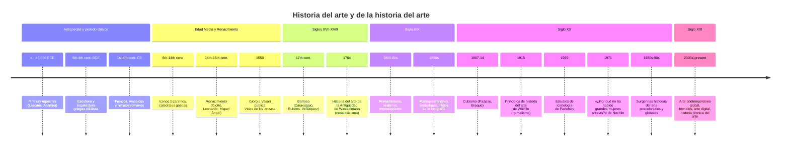

```mermaid
timeline
    title Historia del arte y de la historia del arte
    section Antigüedad y periodo clásico
      c. 40,000 BCE : Pinturas rupestres<br>(Lascaux, Altamira)
      5th‑4th cent. BCE : Escultura y arquitectura<br>griegas clásicas
      1st‑4th cent. CE : Frescos, mosaicos<br>y retratos romanos
    section Edad Media y Renacimiento
      6th‑14th cent. : Iconos bizantinos,<br>catedrales góticas
      14th‑16th cent. : Renacimiento (Giotto,<br>Leonardo, Miguel Ángel)
      1550 : Giorgio Vasari publica<br>Vidas de los artistas
    section Siglos XVII‑XVIII
      17th cent. : Barroco (Caravaggio,<br>Rubens, Velázquez)
      1764 : Historia del arte de la Antigüedad<br>de Winckelmann (neoclasicismo)
    section Siglo XIX
      1800‑80s : Romanticismo, realismo,<br>impresionismo
      1890s : Posimpresionismo,<br>simbolismo, inicios de la fotografía
    section Siglo XX
      1907‑14 : Cubismo (Picasso, Braque)
      1915 : Principios de historia del arte<br>de Wölfflin (formalismo)
      1939 : Estudios de iconología<br>de Panofsky
      1971 : «¿Por qué no ha habido<br>grandes mujeres artistas?» de Nochlin
      1980s‑90s : Surgen las historias del arte<br>poscoloniales y globales
    section Siglo XXI
      2000s‑present : Arte contemporáneo global,<br>bienales, arte digital,<br>historia técnica del arte
```
