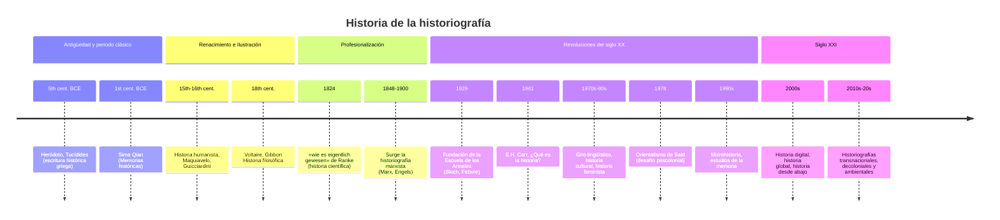

```mermaid
timeline
    title Historia de la historiografía
    section Antigüedad y periodo clásico
      5th cent. BCE : Heródoto, Tucídides<br>(escritura histórica griega)
      1st cent. BCE : Sima Qian<br>(Memorias históricas)
    section Renacimiento e Ilustración
      15th‑16th cent. : Historia humanista,<br>Maquiavelo, Guicciardini
      18th cent. : Voltaire, Gibbon<br>Historia filosófica
    section Profesionalización
      1824 : «wie es eigentlich<br>gewesen» de Ranke (historia científica)
      1848‑1900 : Surge la historiografía marxista<br>(Marx, Engels)
    section Revoluciones del siglo XX
      1929 : Fundación de la Escuela de los Annales<br>(Bloch, Febvre)
      1961 : E.H. Carr, ¿Qué es la historia?
      1970s‑80s : Giro lingüístico, historia<br>cultural, historia feminista
      1978 : Orientalismo de Said<br>(desafío poscolonial)
      1990s : Microhistoria, estudios de la memoria
    section Siglo XXI
      2000s : Historia digital, historia<br>global, historia desde abajo
      2010s‑20s : Historiografías transnacionales,<br>decoloniales y<br>ambientales
```
