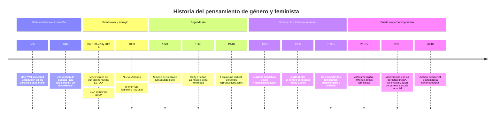

```mermaid
timeline
    title Historia del pensamiento de género y feminista
    section Protofeminismo e Ilustración
      1792 : Mary Wollstonecraft<br>Vindicación de los derechos de la mujer
      1848 : Convención de Seneca Falls<br>(Declaración de sentimientos)
    section Primera ola y sufragio
      late 19th‑early 20th c. : Movimientos de sufragio femenino<br>EE. UU.: 19.ª enmienda (1920)
      1893 : Nueva Zelanda: primer voto<br>femenino nacional
    section Segunda ola
      1949 : Simone de Beauvoir<br>El segundo sexo
      1963 : Betty Friedan<br>La mística de la feminidad
      1970s : Feminismo radical,<br>derechos reproductivos, ERA
    section Tercera ola e interseccionalidad
      1989 : Kimberlé Crenshaw<br>acuña «interseccionalidad»
      1990 : Judith Butler<br>El género en disputa (teoría queer)
      1990s : Se expanden los feminismos<br>poscoloniales y globales
    section Cuarta ola y contemporáneo
      2010s : Activismo digital,<br>#MeToo, blogs feministas
      2015+ : Movimientos por los derechos trans*,<br>transversalización de género a escala mundial
      2020s : Justicia decolonial, ecofeminista<br>e interseccional
```
