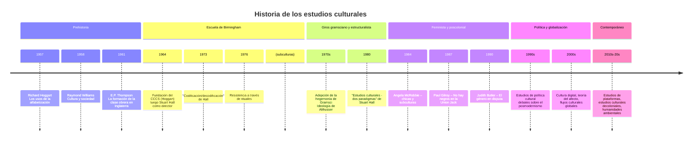

```mermaid
timeline
    title Historia de los estudios culturales
    section Prehistoria
      1957 : Richard Hoggart<br>Los usos de la alfabetización
      1958 : Raymond Williams<br>Cultura y sociedad
      1961 : E.P. Thompson<br>La formación de la clase obrera en Inglaterra
    section Escuela de Birmingham
      1964 : Fundación del CCCS (Hoggart)<br>luego Stuart Hall como director
      1973 : "Codificación/decodificación" de Hall
      1976 : Resistencia a través de rituales
      (subculturas)
    section Giros gramsciano y estructuralista
      1970s : Adopción de la hegemonía de Gramsci<br>Ideología de Althusser
      1980 : "Estudios culturales -<br>dos paradigmas" de Stuart Hall
    section Feminista y poscolonial
      1984 : Angela McRobbie – chicas y<br>subculturas
      1987 : Paul Gilroy – No hay negros en la<br>Union Jack
      1990 : Judith Butler – El género en disputa
    section Política y globalización
      1990s : Estudios de política cultural<br>debates sobre el posmodernismo
      2000s : Cultura digital, teoría del afecto,<br>flujos culturales globales
    section Contemporáneo
      2010s‑20s : Estudios de plataformas,<br>estudios culturales decoloniales,<br>humanidades ambientales
```
