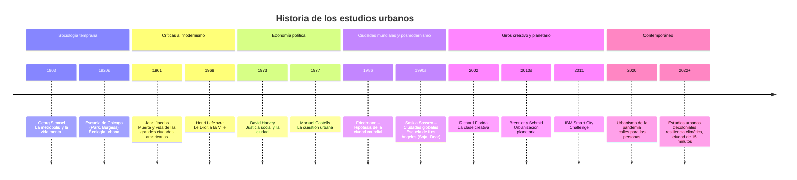

```mermaid
timeline
    title Historia de los estudios urbanos
    section Sociología temprana
      1903 : Georg Simmel<br>La metrópolis y la vida mental
      1920s : Escuela de Chicago (Park, Burgess)<br>Ecología urbana
    section Críticas al modernismo
      1961 : Jane Jacobs<br>Muerte y vida de las grandes ciudades americanas
      1968 : Henri Lefebvre<br>Le Droit à la Ville
    section Economía política
      1973 : David Harvey<br>Justicia social y la ciudad
      1977 : Manuel Castells<br>La cuestión urbana
    section Ciudades mundiales y posmodernismo
      1986 : Friedmann – Hipótesis de la ciudad mundial
      1990s : Saskia Sassen – Ciudades globales<br>Escuela de Los Ángeles (Soja, Dear)
    section Giros creativo y planetario
      2002 : Richard Florida<br>La clase creativa
      2010s : Brenner y Schmid<br>Urbanización planetaria
      2011 : IBM Smart City Challenge
    section Contemporáneo
      2020 : Urbanismo de la pandemia<br>calles para las personas
      2022+ : Estudios urbanos decoloniales<br>resiliencia climática, ciudad de 15 minutos
```
