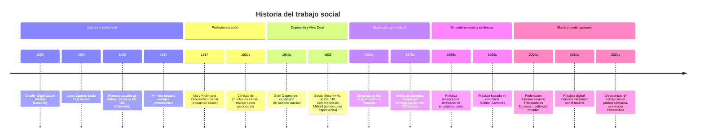

```mermaid
timeline
    title Historia del trabajo social
    section Caridad y settlement
      1869 : Charity Organization Society<br>(Londres)
      1889 : Jane Addams funda Hull House
      1898 : Primera escuela de trabajo social de EE. UU.<br>(Columbia)
      1899 : Primera escuela europea<br>(Ámsterdam)
    section Profesionalización
      1917 : Mary Richmond<br>Diagnóstico social (trabajo de casos)
      1920s : Clínicas de orientación infantil,<br>trabajo social psiquiátrico
    section Depresión y New Deal
      1930s : Gran Depresión – expansión<br>del socorro público
      1935 : Social Security Act de EE. UU.<br>Conferencia de Milford (genérico vs. especialista)
    section Sistemas y giro radical
      1960s : Derechos civiles, Guerra contra la Pobreza
      1970s : Teoría de sistemas, perspectiva<br>ecológica (Germain, Gitterman)
    section Empoderamiento y evidencia
      1980s : Práctica antiopresiva,<br>enfoques de empoderamiento
      1990s : Práctica basada en evidencia<br>(Gibbs, Gambrill)
    section Global y contemporáneo
      2000s : Federación Internacional de<br>Trabajadores Sociales – definición mundial
      2010s : Práctica digital,<br>atención informada por el trauma
      2020s : Decolonizar el trabajo social,<br>justicia climática, resiliencia comunitaria
```
