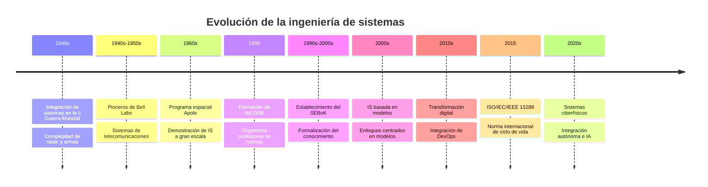

```mermaid
timeline
    title Evolución de la ingeniería de sistemas
    1940s : Integración de sistemas en la II Guerra Mundial
          : Complejidad de radar y armas
    1940s-1950s : Pioneros de Bell Labs
                : Sistemas de telecomunicaciones
    1960s : Programa espacial Apolo
          : Demostración de IS a gran escala
    1990 : Formación de INCOSE
         : Organismo profesional de normas
    1990s-2000s : Establecimiento del SEBoK
                : Formalización del conocimiento
    2000s : IS basada en modelos
          : Enfoques centrados en modelos
    2010s : Transformación digital
          : Integración de DevOps
    2015 : ISO/IEC/IEEE 15288
         : Norma internacional de ciclo de vida
    2020s : Sistemas ciberfísicos
          : Integración autónoma e IA
```
