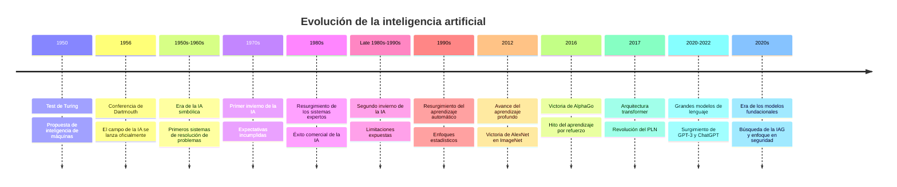

```mermaid
timeline
    title Evolución de la inteligencia artificial
    1950 : Test de Turing
         : Propuesta de inteligencia de máquinas
    1956 : Conferencia de Dartmouth
         : El campo de la IA se lanza oficialmente
    1950s-1960s : Era de la IA simbólica
                : Primeros sistemas de resolución de problemas
    1970s : Primer invierno de la IA
          : Expectativas incumplidas
    1980s : Resurgimiento de los sistemas expertos
          : Éxito comercial de la IA
    Late 1980s-1990s : Segundo invierno de la IA
                     : Limitaciones expuestas
    1990s : Resurgimiento del aprendizaje automático
          : Enfoques estadísticos
    2012 : Avance del aprendizaje profundo
         : Victoria de AlexNet en ImageNet
    2016 : Victoria de AlphaGo
         : Hito del aprendizaje por refuerzo
    2017 : Arquitectura transformer
         : Revolución del PLN
    2020-2022 : Grandes modelos de lenguaje
              : Surgimiento de GPT-3 y ChatGPT
    2020s : Era de los modelos fundacionales
          : Búsqueda de la IAG y enfoque en seguridad
```
