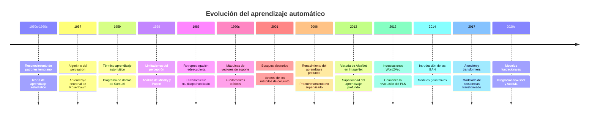

```mermaid
timeline
    title Evolución del aprendizaje automático
    1950s-1960s : Reconocimiento de patrones temprano
                : Teoría del aprendizaje estadístico
    1957 : Algoritmo del perceptrón
         : Aprendizaje neuronal de Rosenbaum
    1959 : Término aprendizaje automático
         : Programa de damas de Samuel
    1969 : Limitaciones del perceptrón
         : Análisis de Minsky y Papert
    1986 : Retropropagación redescubierta
         : Entrenamiento multicapa habilitado
    1990s : Máquinas de vectores de soporte
          : Fundamentos teóricos
    2001 : Bosques aleatorios
         : Avance de los métodos de conjunto
    2006 : Renacimiento del aprendizaje profundo
         : Preentrenamiento no supervisado
    2012 : Victoria de AlexNet en ImageNet
         : Superioridad del aprendizaje profundo
    2013 : Incrustaciones Word2Vec
         : Comienza la revolución del PLN
    2014 : Introducción de las GAN
         : Modelos generativos
    2017 : Atención y transformers
         : Modelado de secuencias transformado
    2020s : Modelos fundacionales
          : Integración few-shot y AutoML
```
