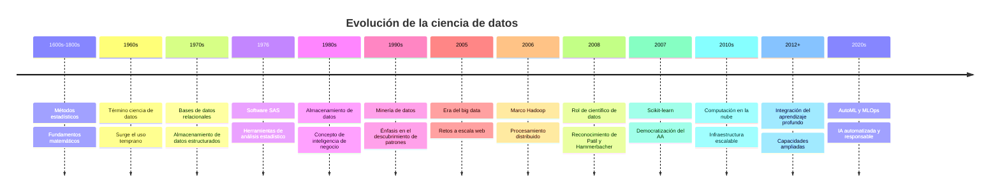

```mermaid
timeline
    title Evolución de la ciencia de datos
    1600s-1800s : Métodos estadísticos
                : Fundamentos matemáticos
    1960s : Término ciencia de datos
          : Surge el uso temprano
    1970s : Bases de datos relacionales
          : Almacenamiento de datos estructurados
    1976 : Software SAS
         : Herramientas de análisis estadístico
    1980s : Almacenamiento de datos
          : Concepto de inteligencia de negocio
    1990s : Minería de datos
          : Énfasis en el descubrimiento de patrones
    2005 : Era del big data
         : Retos a escala web
    2006 : Marco Hadoop
         : Procesamiento distribuido
    2008 : Rol de científico de datos
         : Reconocimiento de Patil y Hammerbacher
    2007 : Scikit-learn
         : Democratización del AA
    2010s : Computación en la nube
          : Infraestructura escalable
    2012+ : Integración del aprendizaje profundo
          : Capacidades ampliadas
    2020s : AutoML y MLOps
          : IA automatizada y responsable
```
