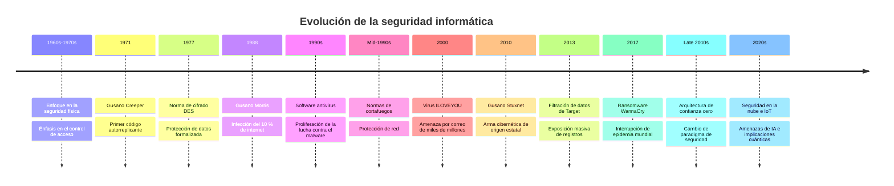

```mermaid
timeline
    title Evolución de la seguridad informática
    1960s-1970s : Enfoque en la seguridad física
                : Énfasis en el control de acceso
    1971 : Gusano Creeper
         : Primer código autorreplicante
    1977 : Norma de cifrado DES
         : Protección de datos formalizada
    1988 : Gusano Morris
         : Infección del 10 % de internet
    1990s : Software antivirus
          : Proliferación de la lucha contra el malware
    Mid-1990s : Normas de cortafuegos
              : Protección de red
    2000 : Virus ILOVEYOU
         : Amenaza por correo de miles de millones
    2010 : Gusano Stuxnet
         : Arma cibernética de origen estatal
    2013 : Filtración de datos de Target
         : Exposición masiva de registros
    2017 : Ransomware WannaCry
         : Interrupción de epidemia mundial
    Late 2010s : Arquitectura de confianza cero
               : Cambio de paradigma de seguridad
    2020s : Seguridad en la nube e IoT
          : Amenazas de IA e implicaciones cuánticas
```
