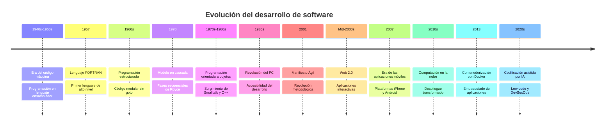

```mermaid
timeline
    title Evolución del desarrollo de software
    1940s-1950s : Era del código máquina
                : Programación en lenguaje ensamblador
    1957 : Lenguaje FORTRAN
         : Primer lenguaje de alto nivel
    1960s : Programación estructurada
          : Código modular sin goto
    1970 : Modelo en cascada
         : Fases secuenciales de Royce
    1970s-1980s : Programación orientada a objetos
                : Surgimiento de Smalltalk y C++
    1980s : Revolución del PC
          : Accesibilidad del desarrollo
    2001 : Manifiesto Ágil
         : Revolución metodológica
    Mid-2000s : Web 2.0
              : Aplicaciones interactivas
    2007 : Era de las aplicaciones móviles
         : Plataformas iPhone y Android
    2010s : Computación en la nube
          : Despliegue transformado
    2013 : Contenedorización con Docker
         : Empaquetado de aplicaciones
    2020s : Codificación asistida por IA
          : Low-code y DevSecOps
```
