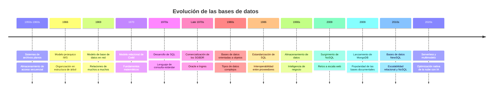

```mermaid
timeline
    title Evolución de las bases de datos
    1950s-1960s : Sistemas de archivos planos
                : Almacenamiento de acceso secuencial
    1966 : Modelo jerárquico IMS
         : Organización en estructura de árbol
    1969 : Modelo de base de datos en red
         : Relaciones de muchos a muchos
    1970 : Modelo relacional de Codd
         : Fundamentos matemáticos
    1970s : Desarrollo de SQL
          : Lenguaje de consulta estándar
    Late 1970s : Comercialización de los SGBDR
               : Oracle e Ingres
    1980s : Bases de datos orientadas a objetos
          : Tipos de datos complejos
    1986 : Estandarización de SQL
         : Interoperabilidad entre proveedores
    1990s : Almacenamiento de datos
          : Inteligencia de negocio
    2009 : Surgimiento de NoSQL
         : Retos a escala web
    2009 : Lanzamiento de MongoDB
         : Popularidad de las bases documentales
    2010s : Bases de datos NewSQL
          : Escalabilidad relacional y NoSQL
    2020s : Serverless y multimodelo
          : Optimización nativa de la nube con IA
```
