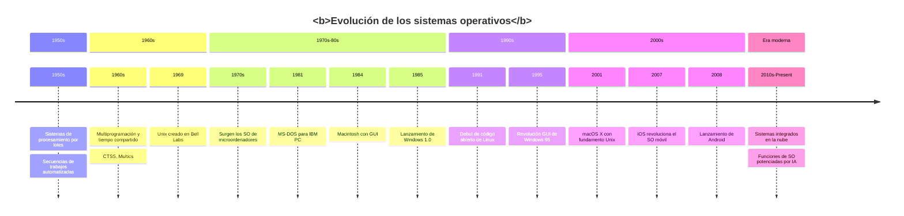

```mermaid
timeline
    title <b>Evolución de los sistemas operativos</b>
    
    section 1950s
        1950s : Sistemas de procesamiento por lotes
              : Secuencias de trabajos automatizadas
    
    section 1960s
        1960s : Multiprogramación y tiempo compartido
              : CTSS, Multics
        1969  : Unix creado en Bell Labs
    
    section 1970s-80s
        1970s : Surgen los SO de microordenadores
        1981  : MS-DOS para IBM PC
        1984  : Macintosh con GUI
        1985  : Lanzamiento de Windows 1.0
    
    section 1990s
        1991  : Debut de código abierto de Linux
        1995  : Revolución GUI de Windows 95
    
    section 2000s
        2001  : macOS X con fundamento Unix
        2007  : iOS revoluciona el SO móvil
        2008  : Lanzamiento de Android
    
    section Era moderna
        2010s-Present : Sistemas integrados en la nube
                      : Funciones de SO potenciadas por IA
```
